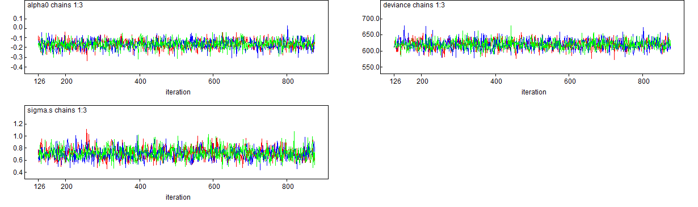
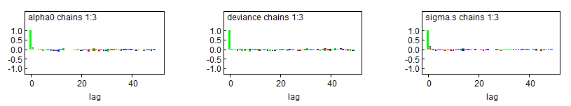
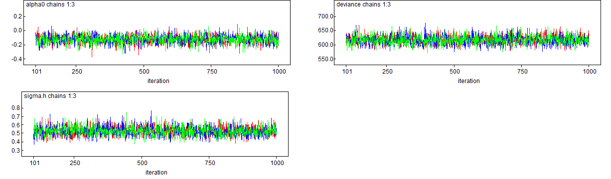
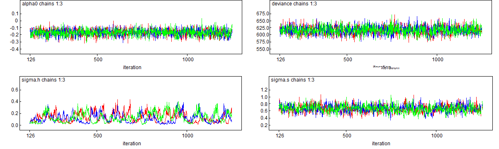
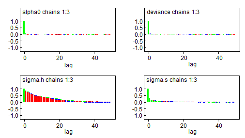

```{r include=FALSE}
knitr::opts_chunk$set( echo=F )
# knitr::opts_chunk$set(out.width = '70%')
knitr::opts_chunk$set(fig.align = "center")
knitr::opts_chunk$set(tidy =TRUE)
knitr::opts_chunk$set(message = FALSE)
```

```{r include=FALSE}
library(spdep)
library(sf)
library(classInt)
library(maptools)
library(R2WinBUGS)
library(foreign)
library(spatialreg)

# load("data.Rdata")
```

## Description

### Data of the incidence of larynx cancer diagnosed during 10 years (1982-1991) in the districts of Mersey and West Lancashire in the north-east of England is in the file larynx-dates.odc. They have detected 876 cases in 144 electoral districts. The number of expected cases were calculated using internal standardization, based on the specific rates of sex and age in the zone of study (with the population of the census 1991). 

### 1) Perform an exploratory analysis to study the possible spatial correlation of the larynx incidence (Standardized Mobility Ratio, SMR) (considering neighbors those regions that share geographic limits and the matrix of weights as the matrix standardized by rows)

```{r}
rm(list=ls())

data = list(

N = 144, 
            
O = c(5, 7, 0, 0, 8, 5, 1, 10, 3, 5, 
4, 7, 3, 6, 1, 5, 4, 6, 3, 3, 2, 2, 9, 8, 6, 10, 9, 15, 14, 12, 
11, 23, 12, 4, 27, 10, 10, 10, 13, 10, 7, 13, 16, 4, 9, 4, 13, 
4, 10, 12, 18, 13, 25, 5, 12, 6, 5, 2, 3, 6, 4, 4, 6, 1, 5, 9, 
7, 1, 5, 1, 4, 3, 3, 2, 3, 9, 5, 9, 19, 4, 12, 1, 2, 8, 6, 4, 
2, 4, 8, 4, 6, 7, 4, 10, 4, 7, 8, 12, 12, 8, 6, 2, 7, 7, 7, 4, 
10, 8, 3, 5, 6, 9, 3, 10, 9, 8, 9, 6, 3, 1, 0, 1, 1, 3, 1, 0, 
1, 0, 2, 5, 0, 0, 1, 0, 0, 1, 2, 4, 2, 2, 3, 0, 0, 1), 

E = c(2.53, 3.94, 3.09, 2.75, 3.81, 3.66, 4.05, 3.07, 3.42, 4.24, 3.9, 3.58, 
3.68, 3.19, 5.15, 3.75, 3.37, 4.52, 1.94, 3.47, 3.48, 3.32, 4.52, 
9.2, 10.37, 8.08, 6.66, 7.7, 9.79, 9.77, 10.17, 9.93, 9.53, 10.59, 
7.64, 7.03, 4.09, 7.66, 8.02, 6.78, 9.85, 7.98, 8.14, 4.07, 7.54, 
7.04, 7.99, 8.1, 5.69, 6.37, 8.2, 6.52, 4.68, 9.11, 11.28, 6.18, 
4.79, 4.98, 6.47, 5.43, 6.51, 4.44, 6.69, 5.55, 6.24, 5.27, 5.61, 
5.31, 6.92, 5.17, 5.13, 3.73, 6.18, 9.44, 7.3, 7.63, 11.66, 6.52, 
6.64, 10.64, 7.15, 8.76, 7.48, 6.06, 6.36, 7.98, 8.92, 9.07, 
6.2, 7.37, 6.68, 8.62, 8.05, 5.97, 8.65, 7.04, 8.91, 5.95, 7.5, 
9.11, 10.59, 7.64, 8.91, 8.72, 11.7, 10.69, 7.73, 8.52, 7.81, 
9.24, 8.25, 10.72, 10.33, 8.19, 10.9, 7, 9.98, 10.1, 2.33, 3.49, 
0.78, 3.59, 2.47, 4.1, 1.82, 0.71, 1.44, 1.76, 3.39, 2.19, 1.66, 
1.35, 2.27, 2.11, 1.05, 2.22, 3.24, 2.65, 3.15, 1.94, 3.13, 1.95, 
2.16, 1.76))

SMR = data$O/data$E

lunghezza = length(SMR)

debug_on=F
codaPkg_on=F
```

The data available to as are the following:

* $O$: Number of observed events
* $E$: Number of Expected events

In the observed regions, 0 to 27 events were registered and the median number of observations is 5. The expected value of the cases was between 0.710 and 11.700 with median 6.365. The two distribution of the data are the following:

```{r out.width="70%"}
hist(data$O, breaks = 25,  col=rgb(1,0,0,0.5), xlab="Number of events",
     ylab="Frequency", main="Distribution of events", probability = FALSE)
hist(data$E, breaks = 12, probability = FALSE, col = rgb(0,0,1,0.5), add=T)
legend("topright", legend=c("Observed","Expected"), col=c(rgb(1,0,0,0.5), rgb(0,0,1,0.5)), pt.cex=2, pch=15 )
```

```{r}
shp.file <- read_sf(dsn = ".", layer = "NWEngland")
spatial.file <- sf::as_Spatial(shp.file)
spatial.file$geometry <- NULL #Eliminate this geographic information
```

```{r}
df <- as.data.frame(spatial.file) #Create a data.frame
NW.dataset <- sp::SpatialPolygonsDataFrame(spatial.file, data = df )

NW.dataset$SMR<-SMR
NW.dataset$NAME = NW.dataset$poly_id
```

```{r}
brks <- round(quantile(NW.dataset$SMR, probs=seq(0,1,0.2)), digits=2)
my.colours <- c("yellow", "orange2", "red3", "brown", "black")
```

We also visualize the distribution of the data on the map of the regions: 
```{r warning=FALSE, out.width="70%"}
plot(NW.dataset, col=my.colours[findInterval(NW.dataset$SMR, brks,all.inside=TRUE)])
legend("right", legend=leglabs(brks),fill=my.colours, bty="n",cex=0.99)
title(main=paste("Standardized Mortality Rate (SMR) during 1982-1991"))
text(coordinates(NW.dataset),label=as.factor(NW.dataset$NAME),cex=0.4)
```

We notice that in the center of the district there's a cluster of regions with high values of SMR, which slowly lower as we get away from the center.

Now we'll analyse the lattice structure of the data, considering neighbors those regions that share geographic limits:
```{r out.width="90%"}
xxnb <- poly2nb(NW.dataset)
plot(NW.dataset, border="grey")
plot(xxnb, coordinates(NW.dataset), add=TRUE, col="blue")
```

After establishing the neighbors we compute the weights (standardized by row). The weights corresponding to the first four regions are:
```{r}
weight.object<-nb2listw(xxnb, glist=NULL, style="W", zero.policy=TRUE) 
weight.list = weight.object$weights
weight.list[1:4]
```

Now we can perform a Moran test to prove or disprove the presence of spatial autocorrelation:

- We do it first using Moran's I statistic:
```{r}
sids.moran<-moran.test(NW.dataset$SMR, weight.object) #Standardazed weights
sids.moran
```
The I statistic is 0.313, which is quite different from the expected value (-0.0069), indeed the p-value is very low ($p=2.4\cdot10^{-10}$), so we reject the null hypothesis.

- We also do it through a Monte Carlo approach:
```{r}
set.seed(1234)
sids.moran.mc<-moran.mc(NW.dataset$SMR, listw=weight.object, nsim=9000)
sids.moran.mc
```
and the p-value is $p=0.000111$, therefore also in this case we reject the null hypothesis.

Both methods lead us to the conclusion that spatial correlation is present. 

### 2) If we consider that the number of cases of Larynx are a Poisson distribution, are data overdispersed?

We try to fit the data with a Poisson model: 

```{R poisson 1}
# laryx.Poisson<-paste(getwd(),"/laringe_poisson_model.odc",sep="")
# laryx.inits<-list(
#                 list(alpha0=0),
#                 list(alpha0=-5e-01),
#                 list(alpha0=rnorm(1))
#             )
# 
# path.winbugs<-paste("C:\\Users\\lofer\\WinBUGS14")
 
# mybugsdir<-"C:\\Users\\lofer\\OneDrive\\Documenti\\GitHub\\Epidemiology_2nd_Assignment\\Poisson"
# 
# results.Poisson<-bugs(data=data, inits=laryx.inits,
#                   # parameters.to.save = c("RR","alpha0"),
#                   parameters.to.save = c("alpha0"),
#                   model.file=laryx.Poisson, n.chains=3, n.iter=2000, n.burnin = 1000,
#                   bugs.directory=path.winbugs, debug=debug_on, codaPkg=codaPkg_on, working.directory=mybugsdir)
# 
# print(results.Poisson)
```

If the Poisson model fits the data reasonably, we would expect the residual deviance to be roughly equal to the
degrees of freedom ($n-p=143$).

```{r}
model.glm <- glm(O ~ 1, offset=E, family = quasipoisson(link = "log"), data=data)
summary(model.glm)
```

But we can notice that the residual deviance is very large (3557.1) and that the dispersion parameter is 304.254. Therefore we can conclude that the data are overdispersed.

### 3) Fit the SMR taking into account the over-dispersion of the data using a heterogeneity model, a spatial (CAR intrinsic) and the convolution model. Estimate the models using Bayesian inference (Gibbs Sampling). Use three chains of initial values.

(for the sake of clarity we didn't show the estimates of $RR$, the Relative Risk)

- Heterogeneity model: unstructured overdispersion
```{R cache=T}
path.winbugs = "C:\\Users\\lofer\\WinBUGS14"
mybugsdir<-"C:\\Users\\lofer\\OneDrive\\Documenti\\GitHub\\Epidemiology_2nd_Assignment\\Hetero"
# mybugsdir<- paste(getwd(), "/Hetero", sep="")

laryx.heterogenity<-paste(getwd(),"/laryx-heterogeneity-model.odc",sep="")
laryx.inits.heterogenity<-list( list(tau.h = 1, alpha0 = 0, h= rep(0, lunghezza)),
                                list(tau.h = 0.005, alpha0 = -0.5, h= rep(0, lunghezza)), 
                                list(tau.h = 0.5, alpha0 = 1, h= rep(0, lunghezza)))

results.heterogenity<-bugs(data=data,inits=laryx.inits.heterogenity, 
                           parameters.to.save = c("alpha0","tau.h","sigma.h"),
                           model.file=laryx.heterogenity,n.chains=3,n.iter=10000,n.burnin=1000,n.thin = 10,
                           bugs.directory=path.winbugs,debug=debug_on,codaPkg=codaPkg_on,working.directory=mybugsdir)

print(results.heterogenity)

results.heterogenity<-bugs(data=data,inits=laryx.inits.heterogenity, 
                           parameters.to.save = c("alpha0","tau.h","sigma.h","resid","RR"),
                           model.file=laryx.heterogenity,n.chains=3,n.iter=10000,n.burnin=1000,n.thin = 10,
                           bugs.directory=path.winbugs,debug=debug_on,codaPkg=codaPkg_on,working.directory=mybugsdir)
```

- Spatial model: we model a structured overdispersion, using the spatial structure we have created above (the neighbors, the weights and the corresponding adjacency matrix)
```{R spatial 1}
laryx.spatial<-paste(getwd(),"//laryx-spatial-model.odc",sep="")

w.laryx<-nb2listw(xxnb, style="W", zero.policy=TRUE)

adj<-unlist(w.laryx$neighbours)
adj<-adj[adj!=0]
data.spatial<-list(N=data$N,O=data$O,E=data$E,adj=adj,num=card(xxnb),sumNumNeigh=sum(card(xxnb)) )
```

```{R spatial 2, cache=T}

mybugsdir<-"C:\\Users\\lofer\\OneDrive\\Documenti\\GitHub\\Epidemiology_2nd_Assignment\\Spatial"

laryx.inits.spatial<-list(
  list(alpha0=0,s=rnorm(lunghezza),tau.s=exp(rnorm(1))),
  list(alpha0=-5e-01,s=rnorm(lunghezza),tau.s=exp(rnorm(1))),
  list(alpha0=rnorm(1),s=rnorm(lunghezza),tau.s=exp(rnorm(1))))

results.spatial<-bugs(data=data.spatial,inits=laryx.inits.spatial,
                           parameters.to.save = c("alpha0","tau.s","sigma.s"),
                           model.file=laryx.spatial,n.chains=3,n.iter=7000,n.burnin = 1000,n.thin=8,
                           bugs.directory=path.winbugs,debug=debug_on,codaPkg=codaPkg_on,working.directory=mybugsdir)

print(results.spatial)

results.spatial<-bugs(data=data.spatial,inits=laryx.inits.spatial,
                           parameters.to.save = c("alpha0","tau.s","sigma.s", "RR", "resid"),
                           model.file=laryx.spatial,n.chains=3,n.iter=7000,n.burnin = 1000,n.thin=8,
                           bugs.directory=path.winbugs,debug=debug_on,codaPkg=codaPkg_on,working.directory=mybugsdir)
```

- Convolution model: we create a model which takes into account both a structured (spatial) overdispersion and an unstructured (heterogeneity) one
```{R convolutional, cache=T}

mybugsdir<-"C:\\Users\\lofer\\OneDrive\\Documenti\\GitHub\\Epidemiology_2nd_Assignment\\Convo"

laryx.convolution<-paste(getwd(),"//laryx-convolution-model.odc",sep="")
laryx.inits.convo<-list(
  list(alpha0=0.00000E+00, h=rnorm(lunghezza),tau.h=exp(rnorm(1)), s=rnorm(lunghezza),tau.s=exp(rnorm(1))),
  list(alpha0=-5.00000E-01,h=rnorm(lunghezza),tau.h=exp(rnorm(1)),s=rnorm(lunghezza),tau.s=exp(rnorm(1))),
  list(alpha0=rnorm(1), h=rnorm(lunghezza),tau.h=exp(rnorm(1)),s=rnorm(lunghezza),tau.s=exp(rnorm(1))))

results.convo<-bugs(data=data.spatial,inits=laryx.inits.convo,
                    parameters.to.save = c("alpha0","tau.s","sigma.s","tau.h","sigma.h"),
                    model.file=laryx.convolution,n.chains=3,n.iter=10000,n.burnin = 1000,n.thin=8,
                    bugs.directory=path.winbugs,debug=debug_on,codaPkg=codaPkg_on,working.directory=mybugsdir)

print(results.convo)

results.convo<-bugs(data=data.spatial,inits=laryx.inits.convo,
                    parameters.to.save = c("RR", "alpha0","sigma.s","sigma.h", "frac.spatial","s2.marginal", "sigma2.h"),
                    model.file=laryx.convolution,n.chains=3,n.iter=10000,n.burnin = 1000,n.thin=8,
                    bugs.directory=path.winbugs,debug=debug_on,codaPkg=codaPkg_on,working.directory=mybugsdir)
```

### 4) Check the convergence and study the autocorrelation of the chain. Decide which model fit better the data.

To study the convergence we look both at the traceplots of the fitted parameters (the 3 chains should stabilize after some time around the same value) and at the $\hat{R}$ coefficient of the parameters of the models (we'll assume that convergence is reached if $\hat{R} < 1.05$)

To study the autocorrelation of the chain we look at the autocorrelation plots which WinBugs gives us and verify that the values of the correlations of the chain in different iterations are low, meaning that different iterations are not or almost not correlated with each other. 

- Spatial:

All the $\hat{R}$ coefficients are below 1.05, indeed the maximum value we get is:
```{r}
max( results.spatial$summary[,8] )
```

and the traceplots are:



The autocorrelation plots are:



The chains of the studied parameters seem to have converged, oscillating around a value, and the correlation plots don't present any kind of correlations between contiguous iterations, since all values are low.

- Heterogeneity:

All the $\hat{R}$ coefficients are below 1.05, indeed the maximum value we get is:
```{r}
max( results.heterogenity$summary[,8] )
```

and the traceplots are:



The autocorrelation plots are:


The chains of the studied parameters seem to have converged, oscillating around a value, and the correlation plots don't present any kind of correlations between contiguous iterations, since all values are low.

- Convolutional:

All the $\hat{R}$ coefficients are below 1.05, indeed the maximum value we get is:
```{r}
max( results.convo$summary[,8] )
```

and the traceplots are:



Since there are more than one random effect, the convergence of the parameters is harder to reach because the Monte Carlo Markov Chain struggles to find a stable value of sigma_h to converge to. 

The autocorrelation plots are:



We also have issues with the autocorrelation of the chains for sigma_h: even using a high value for the thin parameter it's difficult to find a chain with no or little autocorrelation. So we'll avoid choosing the Convolutional model.

We can also evaluate the DIC (Deviance Information Criterion):
```{R}
df= data.frame( type=c("spatial", "heterogeneity", "convolutional"), 
                DIC = c(results.spatial$DIC, results.heterogenity$DIC, results.convo$DIC) )
df
```

The DIC index is an estimate of expected predictive error, so we'll choose the model with the lowest DIC. The Spatial model and the Convolutional model are almost comparable, but even though the Convolutional has a slightly lower DIC we'll choose the Spatial, due to the two considerations we have made above.

### 5.1) Using the model that better fit the data: Make a plot of the observed SMRs and Relative Risk estimated by the model (mean posterior of SMR), using the percentiles of the values. Compare them and discuss the differences.

```{r}
chosen.model = results.spatial
RR.vector = chosen.model$mean$RR
```

```{r}
my.colours <- c("yellow", "orange2", "red3", "brown", "black")
brks <- round(quantile(NW.dataset$SMR, probs=seq(0,1,0.2)), digits=2)

layout(matrix(c(1,2,3), nrow = 1), widths = c(3,1.7,3))

plot(NW.dataset, col=my.colours[findInterval(SMR, brks,all.inside=TRUE)], main="SMR")
text(coordinates(NW.dataset), label=round(SMR, digits=2),cex=0.5)
# legend("bottom", legend=leglabs(names(brks)),fill=my.colours, bty="n",cex=0.83, title="Percentils")

plot.new()
legend("center", legend=leglabs(names(brks)),fill=my.colours, bty="n",cex=1, title="Percentils")

brks <- round(quantile(RR.vector, probs=seq(0,1,0.2)), digits=2)
plot(NW.dataset, col=my.colours[findInterval(RR.vector, brks,all.inside=TRUE)], main="RR")
text(coordinates(NW.dataset), label=round(RR.vector, digits=2),cex=0.5)
# legend("bottom", legend=leglabs(names(brks)),fill=my.colours, bty="n",cex=0.83, title="Percentils")
```

The values of RR estimated by the model follow a radial pattern, with higher values in the center and gradually lower values far from the center. Its pattern is smoother than the one followed by the observed values of SMR, which presents many low-value hotspots in the center and some high-value clusters in the north. 

We could say that the SMR has two main clusters (center and north), of which only one is recognized by the model (the central one). Nonetheless, from a qualitative point of view, the chosen model can describe well the phenomenon, even though just in a rough way and not so in detail. 

### 5.2) Make a plot showing the posterior probability of relative risk of the electoral districts that exceed 1. What do you observe? 

```{r}
RR.simul=chosen.model$sims.list$RR
prob.vector = rep(NA, lunghezza)
for (i in 1:lunghezza) {
  prob.vector[i]=sum(RR.simul[,i]>1) / (dim(RR.simul)[1])
}
PV = round(prob.vector, digits = 2)

my.colours <- c("darkgreen", "green", "lightgreen", "yellow", "orange2", "red3")
# brks <- round(quantile(PV, probs=seq(0,1,0.2)), digits=2)
brks <- c(0, 0.1, 0.3, 0.5, 0.7, 0.9, 1)
plot(NW.dataset, col=my.colours[findInterval(PV, brks,all.inside=TRUE)], main="prob(RR>1)")
text(coordinates(NW.dataset), label=round(PV, digits=2),cex=0.35)
legend("left", legend=leglabs(brks),fill=my.colours, bty="n",cex=0.83, title="")
```

Let's analyse the meaning of the SMR: a ratio greater than 1 indicates that more mortality has occurred expected, therefore we can state with pretty high probability that the highlighted regions have an increase in the value of the observed cases ($p>50\%$ for the yellow regions, $p>70\%$ for the orange ones, $p>90\%$ for the red ones).

We may suppose the presence of an underlying phenomenon which is causing this increase of the mortality due to larynx cancer. For example it may be linked to some change of the environmental/working conditions in the areas under investigation.

### 5.3) Make a plot showing the random effects for each districts (exponential scale) and another with the significance of this parameters. What do you observe?

The random effect is the spatial effect $s[i], \forall i\in\{1, .., 144\}$. If we want to see it in exponential scale, we'll use $resid[i]=e^{s[i]}$.

Notice that the formula for RR is $RR[i] = e^{\alpha_0 + s[i]} = e^{\alpha_0} \cdot e^{s[i]}$ and the multiplying factor is exactly $e^{s[i]}$.

```{r}
resid=chosen.model$mean$resid
random.effect = log(resid)

layout(matrix(c(1,2,3), nrow = 1), widths = c(3,1.2,3))

my.colours <- c("darkgreen", "green", "orange2", "red3")
# brks <- round(quantile(random.effect, probs=seq(0,1,0.25)), digits=2)
brks <- c(min(random.effect), -0.3, 0, 0.35, max(random.effect))
# brks = c( seq(min(random.effect), 0, length=3), seq(0, max(random.effect), length=3) )
# brks = round(brks[-3], digits=2)
plot(NW.dataset, col=my.colours[findInterval(random.effect, brks,all.inside=TRUE)], main="Random Effect")
text(coordinates(NW.dataset), label=round(random.effect, digits=2),cex=0.5)
legend( "bottom", legend=leglabs(brks),fill=my.colours, bty="n",cex=0.8)

plot.new()

# brks <- round(quantile(resid, probs=seq(0,1,0.25)), digits=2)
brks = c(min(resid), 0.74, 1, 1.41, max(resid))
plot(NW.dataset, col=my.colours[findInterval(resid, brks,all.inside=TRUE)], main="Significance")
text(coordinates(NW.dataset), label=round(resid, digits=2),cex=0.5)
legend("bottom", legend=leglabs(brks),fill=my.colours, bty="n",cex=0.8)
```

These plots show how the spatial effect affects the values of the RR estimated by the model: 

- In the regions where $s[i]>0$, so $e^{s[i]}>1$, RR is positively influenced by the spatial effect, leading to a higher number of deaths than expected. We also notice that the higher $e^{s[i]}$, the stronger the influence.
- Viceversa in the regions where $s[i]<0$, so $e^{s[i]}<1$, RR is negatively influenced by the spatial effect, leading to a lower number of deaths than expected.


```{r}
save.image("data.Rdata")
```